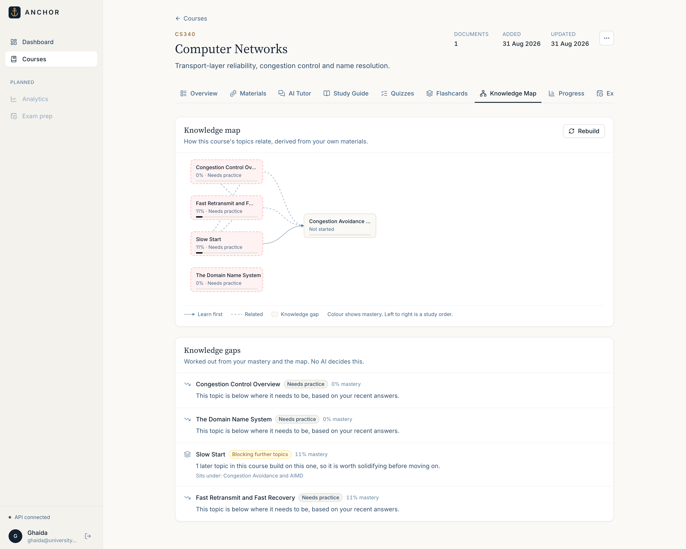
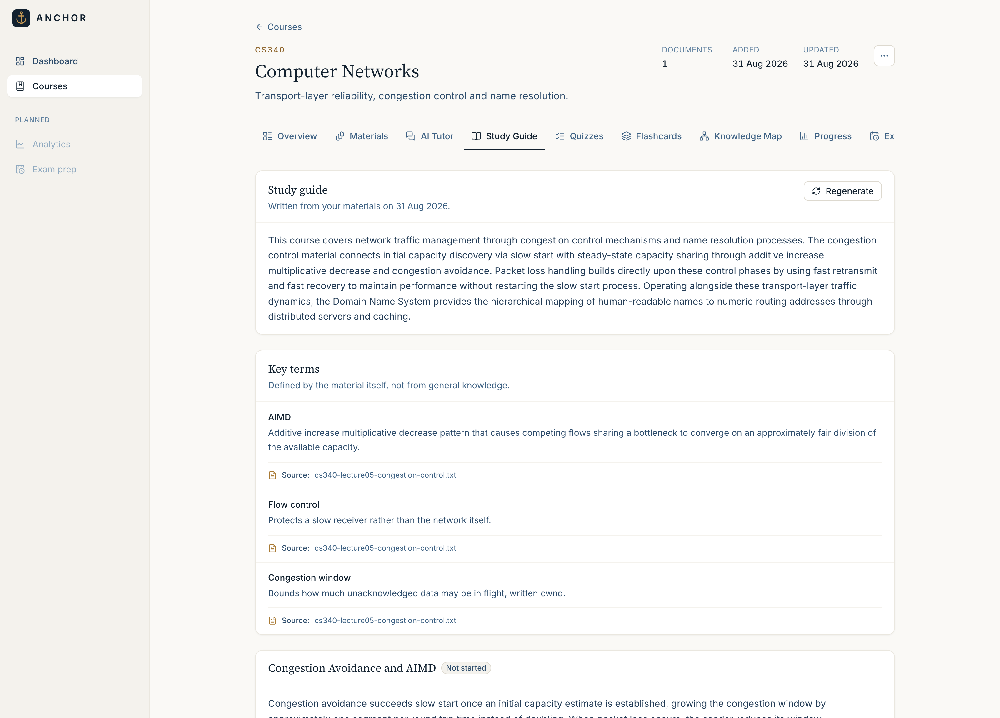
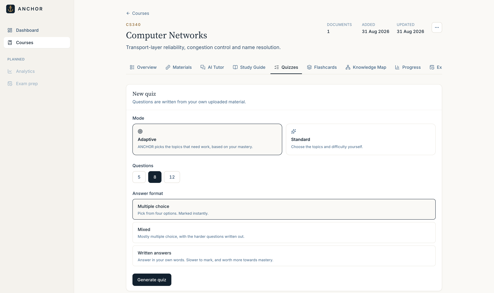
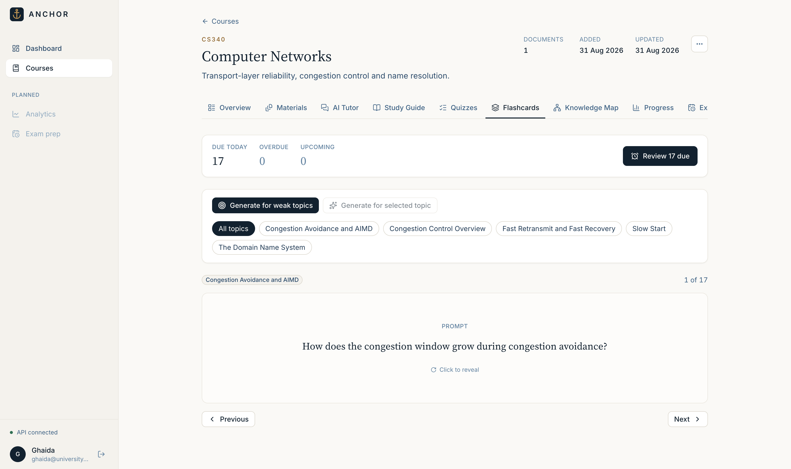
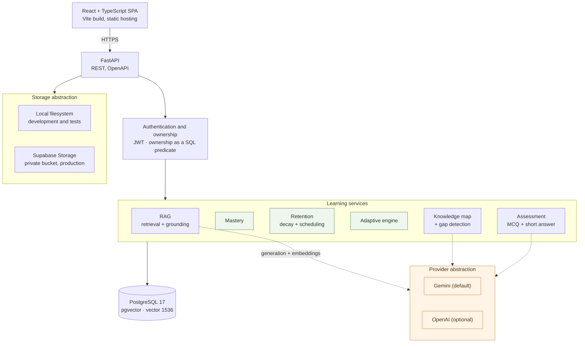
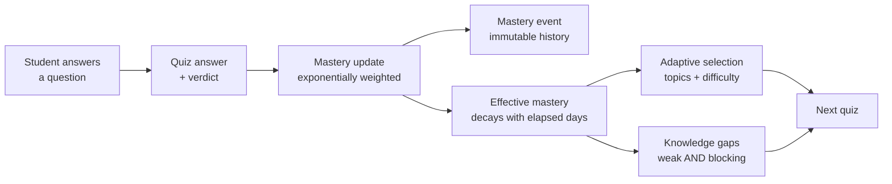

<div align="center">

# ⚓ ANCHOR

### AI-Powered Adaptive Learning

**Turn your own course materials into a study workspace that knows what you actually know.**

[](https://github.com/ghaida-ahmed/anchor/actions/workflows/ci.yml)


### 🔗 **[Try the live application →](https://anchor-eight-iota.vercel.app)**

</div>

---

## 🎯 The problem

Generic AI study tools fail a student being examined on a specific syllabus in two ways.

**They answer from the internet, not from your course.** Ask a chatbot about congestion control and it explains congestion control — not the version your lecturer taught, with their emphases and notation, which is what the exam asks about. When it is confidently wrong you have no way to tell, because there is nothing to check the answer against.

**They do not know what you know.** A tool that generates ten questions generates the same ten for a student who has mastered the topic and one who has never seen it. Nothing tracks whether an answer six weeks ago still means anything today, and *"what should I study next?"* gets answered by a model guessing rather than by evidence.

---

## 💡 How ANCHOR works

ANCHOR splits the problem in two and gives each half to the thing that is actually good at it.

**Retrieval grounds every generated word in the student's own upload.** Material is chunked, embedded, and stored in PostgreSQL with pgvector. Answering retrieves the passages that address the question, and the model is shown *numbered excerpts* and told to cite an excerpt **number**. The application maps that number back to the `DocumentChunk` row it supplied. The model never writes a filename or a page number, so it cannot invent one — **a citation is a database lookup, not parsed text.**

**Everything about the student is deterministic.** Mastery, retention decay, spaced-repetition intervals, topic selection, difficulty, and knowledge-gap detection are pure functions over stored evidence, unit-tested against exact expected values. No model decides what a student knows or what they should do next.

> **The backend decides *what* the learner should practise, from mastery and retention evidence.
> Gemini only shapes *how* that grounded practice is written.**

| 🧮 Deterministic backend | ✨ Gemini |
|---|---|
| which topics to practise, and at what difficulty | writing the questions and explanations |
| how mastery changes, and how it decays with time | naming the topics found in the material |
| when a flashcard is due | judging how two topics relate |
| which topics are knowledge gaps | marking a written answer against a rubric |
| how a verdict changes mastery | writing the study guide's prose |
| where the student's day begins and ends | |

That division is enforced structurally, not by convention: the mastery, retention and adaptive modules have **no provider dependency to inject**, so they cannot reach a language model even by accident.

---

## 📸 Product preview

*Real screenshots from the deployed application.*

### The AI Tutor answers only from your material — and cites it

Every answer names the document it came from. Ask something the material does not cover and ANCHOR says so rather than inventing an answer.


### The knowledge map, derived from the material itself

Topics that the course discusses together become candidate pairs; the model judges the relationship, and only edges backed by real excerpts are stored. Prerequisites read left to right, so the columns *are* a study order. **Knowledge gaps below are computed deterministically — no AI decides them.**



### Progress and mastery analytics

Per-topic mastery, what to review next, and why — all traced back to answers the student actually gave.


<details>
<summary><b>More screens</b> — landing, dashboard, materials, study guide, quizzes, flashcards, exam prep</summary>

<br>

**Landing page**


**Dashboard**


**Course materials** — upload, extraction and indexing status per document


**Study guide** — one section per topic, written from the material and cited, with live mastery badges overlaid



**Quizzes** — multiple-choice and grounded short-answer, chosen adaptively



**Flashcards** — spaced repetition with a due-review queue



**Exam preparation** — coverage-first selection that hardens as the date approaches


</details>

---

## ✨ Key features

| | |
|---|---|
| 🤖 **AI Tutor** | Grounded answers with document-and-page citations, or an honest *"your material does not cover this"* |
| 📝 **Adaptive quizzes** | Multiple-choice and written answers, with topics and difficulty chosen by the mastery engine |
| ✍️ **Short-answer grading** | Marked against key concepts extracted from the source, with a first-class `uncertain` verdict |
| 📈 **Mastery & retention** | A stored score plus an *effective* score that softens with inactivity — without destroying the evidence |
| 🔁 **Spaced repetition** | Flashcards scheduled by interval and ease, with a due queue on the student's **local** day |
| 🕸️ **Knowledge map** | Prerequisite and related links derived from passages that discuss both topics, with the excerpts attached |
| 🎯 **Knowledge gaps** | The weak topics *blocking* other topics, ranked by a documented formula — computed, never generated |
| 📖 **Study guide** | One section per topic, persisted, cited, and marked stale when the material changes |
| 📅 **Exam prep** | An optional exam date shifts selection towards coverage and hardens difficulty as it approaches |

---

## 🏗️ Architecture



Solid arrows are always taken; **dotted arrows reach a language model**. Mastery, retention and the adaptive engine have no path to a provider at all.

### The evidence pipeline



---

## 🔬 How it actually works

<details>
<summary><b>Retrieval-augmented generation</b> — extraction, chunking, embeddings, and how grounding is enforced</summary>

<br>

**Extraction** reads PDF, TXT and Markdown, preserving page numbers so a citation can point at one. There is no OCR: a scanned PDF fails honestly rather than producing empty text.

**Chunking** is token-aware at 512 tokens with 64 tokens of overlap, measured with `tiktoken` rather than characters — a chunk boundary should fall where a model would see it.

**Embeddings** use `gemini-embedding-001` at **1536 dimensions**. That width is a property of the *database column* (`document_chunks.embedding vector(1536)`), not of a provider. Gemini emits 3072 natively and is truncated via Matryoshka `output_dimensionality`; MTEB is identical at both widths, and pgvector cannot index beyond 2000 dimensions, so 1536 is the better width regardless.

**Retrieval** ranks by cosine distance (`<=>`, `vector_cosine_ops`). Cosine rather than inner product because it is bounded `[0, 2]`, which makes `similarity = 1 - distance` a stable number to threshold on.

**Two thresholds, both measured rather than guessed.** `RAG_MIN_SIMILARITY = 0.55` was calibrated over 20 queries against a real course PDF: off-topic best matches scored 0.449–0.489, on-topic 0.635–0.771. The floor sits in that gap, biased low — wrongly refusing a fair question is worse than passing a weak one. `RAG_CITATION_MARGIN = 0.15` then drops chunks far below the best match *before* the context is built, because retrieval returns a ranked list, not a relevance verdict: on a narrow question the 4th hit can be unrelated material that merely cleared the floor, and citing it tells the student a document supported an answer it had nothing to do with.

**Grounding is enforced by construction.** The model sees numbered excerpts and returns an excerpt *number*. The application resolves that number to the chunk it supplied. A number outside the supplied range is rejected and the item discarded. The model is never asked for a filename or a page, so it cannot fabricate one — and a citation for TXT or Markdown reports **no page at all**, because those formats have none and "page 1" would be invented precision.

**No LangChain.** The one query that matters — retrieval — must apply ownership as a predicate *inside* the same SQL statement as the vector search. Expressing that through a framework's retriever metadata filters was more indirection than the ~40 lines it replaces.

</details>

<details>
<summary><b>The mastery formula</b> — why it is arithmetic, and what the constants mean</summary>

<br>

On every answered question, for that topic:

```
raw' = raw + (α · w) · (target − raw)

target = 100 if correct else 0
α      = 0.30                       (base learning rate)
w      = EVIDENCE_WEIGHT[difficulty][correct]
```

An exponentially-weighted moving average: each answer pulls the score a fraction of the way towards the outcome, so older answers decay in influence without ever being stored or re-read. That is the "recent answers matter more" requirement, for the cost of one float.

**The weight depends on difficulty *and* outcome**, because not all answers are equally informative:

| | correct | incorrect |
|---|---|---|
| **easy** | 0.6 | 1.2 |
| **medium** | 1.0 | 1.0 |
| **hard** | 1.4 | 0.7 |

Getting an easy question right says little; getting one wrong is a strong signal. Hard questions are the mirror image. So the step size tracks how *surprising* the outcome was — which is what stops a strong student being wrecked by one hard miss while still punishing an easy miss properly.

**Confidence damping** prevents one lucky answer reading as mastery:

```
confidence = min(1, evidence / 5)
mastery    = raw × (0.5 + 0.5 × confidence)
```

One correct medium answer from zero gives raw 30 but a *displayed* 18 — not mastery. By the fifth answer the damping is gone.

**These constants are reasoned, not fitted.** They were chosen to satisfy stated properties and are covered by exact-value tests. They have not been calibrated against real learning outcomes, and the README does not claim otherwise.

</details>

<details>
<summary><b>Retention</b> — stored vs effective mastery, and why time never rewrites the record</summary>

<br>

A score earned six weeks ago should not read the same as one earned today. But **stored mastery is never mutated by the passage of time** — a background job that decayed every row daily would grow without bound and record nothing.

Instead, decay is derived **on read**:

```
half_life = 30 days, extended by the evidence behind the score
retention = FLOOR + (1 − FLOOR) · 0.5^(days / half_life)      FLOOR = 0.55
effective = stored × retention
```

The floor matters: forgetting is not total. A topic genuinely learned and then left alone does not fall to zero, and the model should not claim it does.

`effective_mastery` drives selection and gap detection; `mastery_score` remains the record of what the student demonstrated. Both are shown, and never conflated.

**Mastery history is event-sourced** — a row exists only where something actually happened, and `effective_mastery_at_event` is frozen at write time so that changing the decay heuristic later cannot silently rewrite a chart of last month.

**This is a heuristic, and is described as one.** It is not FSRS, it is not a memory model, and it makes no scientific claim.

</details>

<details>
<summary><b>Adaptive selection and spaced repetition</b></summary>

<br>

Topic selection ranks candidates by a priority that combines effective mastery, staleness, and review pressure, then allocates questions across the top few — with a guard so a Strong topic that already earned its place is not swapped out for a review slot.

**Difficulty follows the band**, not the student's preference: a *Needs practice* topic gets mostly easy questions, a *Strong* one gets mostly hard, and the mix shifts as the band does.

**Spaced repetition** is an interval/ease scheduler in the SM-2 family, with ANCHOR's own constants. A rating of *Again* resets the interval and lowers ease; *Easy* extends it. Flashcards affect mastery at **reduced weight** — a self-reported "I remembered that" is softer evidence than a marked question, and positive flashcard evidence is capped so pressing *Easy* repeatedly cannot manufacture mastery. Negative evidence is never capped: failing a card should always be able to lower a score.

**Due dates are local-day.** "Due today" means due before the end of the student's own day, so opening ANCHOR in the morning shows the whole day's work rather than trickling cards in as their instants pass.

</details>

<details>
<summary><b>Grounded assessment</b> — short answers, the grading pipeline, and honest uncertainty</summary>

<br>

Multiple choice remains the default. Short answers are generated with a **reference answer and 2–4 key concepts** — the rubric is written with the question and stored, so a later regrade uses the same criteria.

Marking is wrapped on both sides, because a model judgement here changes a student's record:

| Layer | What it does |
|---|---|
| **1 — input** | Neutralise forged fence markers and control characters; mark an empty answer without spending a call |
| **2 — assessment** | One structured call: rubric, reference answer, and the student's text **inside a labelled fence** |
| **3 — output** | Match results onto **our** stored concepts; reject a verdict that contradicts them |

**Embedding similarity is not the grader, nor a tie-breaker.** It scores topical overlap, not correctness: *"TCP halves the window on loss"* and *"TCP doubles the window on loss"* embed almost identically and mean opposite things. Similarity cannot represent negation, and negation is most of what separates right from wrong here.

**Prompt injection** is treated as a real threat, because the student's answer is untrusted input. It is placed last, inside explicit fence markers, and the system prompt says in advance that the block is data. Forged fences cannot escape: the input is NFKC-normalised (catching lookalike dashes) and any fence-shaped line is neutralised — without altering the student's actual words. The rubric is ours, so invented concepts are discarded. And a self-contradicting verdict — "correct" with nothing satisfied — becomes `uncertain` rather than being trusted.

> Verified against the live API: three separate injection attempts (plain override, forged fence, role hijack) were each marked **incorrect with zero concepts satisfied**.

**`uncertain` is a first-class result, not an error.** Rubric marking is fallible, so the grader can say so. An uncertain verdict changes mastery **not at all**, is **excluded from the score denominator** rather than counted as a miss, and is shown as *"Not marked"* in neutral styling. A grading *failure* behaves identically — the student answered; a provider outage is not their mistake.

```
correct            1.0
partially_correct  0.5
incorrect          0.0
uncertain          excluded from the denominator
unanswered         counted — skipping is not the same as not being markable
```

</details>

<details>
<summary><b>Knowledge map and gap detection</b> — finding structure without O(n²) model calls</summary>

<br>

Asking a model about every topic pair is quadratic: 25 topics is 300 calls. Instead the **candidates are found deterministically** — retrieve each topic's top chunks, and a pair becomes a candidate only if the two topics **share a chunk**, meaning the material discusses them in the same place. Candidates are ranked by shared-chunk count, capped, and judged **8 per call**. A five-topic course took **2 calls**, not 10.

Sharing a chunk is evidence of *proximity*, not of a relationship — the prompt says so explicitly, and `"none"` is a first-class answer.

**Confidence is a count, not a probability.** `supporting_chunk_count` is the number of real chunks cited, displayed as *"supported by N excerpts"* with the sources listed. A model's stated confidence is unverifiable; three excerpts the student can click through are not.

**Cycles are rejected at write time.** Edges are accepted one at a time against a transitive closure of what must come first; an edge that would close a cycle is dropped, and better-evidenced pairs are judged first so the surviving edge is the better-supported one.

**Gap detection never consults a model.** A topic is reported only when it is below `GAP_THRESHOLD = 60` on effective mastery **and** there is evidence the student is engaged with that region — either they attempted the topic, or they attempted something that depends on it. That second rule is what stops a fresh course reporting every topic as a gap on day one.

```
deficit  = (60 − effective) / 60
blocked  = transitive dependents, capped at 4
severity = min(1, deficit × (1 + 0.15 × blocked) + 0.35 if a dependent was attempted)
```

The `UNMET_BONUS` fires when the student is building on ground that is not solid — the single most useful thing this feature can say.

**The graph is drawn with inline SVG, no graph library.** A longest-path layering over prerequisite edges, so columns read as a study order. Below `md` it becomes a list with the same ordering and explicit *"Builds on …"* lines — a graph squeezed into 375 px is decoration, not information.

</details>

<details>
<summary><b>The study guide</b> — hierarchical generation and staleness</summary>

<br>

One grounded call per topic, then a **single** synthesis call over the summaries those produced — **n + 1 calls for n topics**. One prompt holding the whole course would not fit a real syllabus, and what it produced would be grounded in whatever survived truncation.

Only the per-topic calls see excerpts, so only they cite. The overview is written from summaries and carries none, because it has nothing first-hand to cite.

**Mastery is not baked in.** The guide is stored text about the material; the badges beside each section are overlaid at read time. Freezing a badge into generated prose would make the guide wrong the moment the student answered a question.

**Staleness** is a SHA-256 fingerprint of the ready documents and the active topic set. A mismatch marks the guide `stale` — readable, labelled, and regenerated only on request. It is never silently regenerated (that spends the student's quota without asking) and never silently served as current (that would be a lie about provenance). Answering a quiz does not make it stale; uploading a document does.

</details>

---

## 🔐 Security and privacy

A student's uploaded material is private, and the design treats it that way.

| Concern | How it is handled |
|---|---|
| **Cross-user access** | Ownership is a predicate *inside* the same SQL statement as the query, never a check after fetching. Retrieval joins `chunks → documents → courses → courses.user_id`, so another student's material cannot enter a result set at all |
| **Resource enumeration** | Another user's resource returns `404`, not `403` — a 403 confirms it exists |
| **Passwords** | bcrypt, used directly. Over 72 bytes is rejected rather than silently truncated, which would make two long passwords interchangeable |
| **Tokens** | HS256 with the algorithm list pinned at decode, so an `alg: none` token cannot pass |
| **Provider credentials** | Server-side only. The frontend has no reference to any key; anything `VITE_*` is compiled into a public bundle and holds only the API's own URL |
| **Private material** | Uploads go to a **private** bucket. No public or signed URL is ever minted — bytes stream *through* FastAPI, so the ownership check stays the only way in |
| **Uploads** | Extension allow-list, magic-byte check (the browser's MIME type is not trusted), size limit, and a generated storage key — the user's filename never touches the filesystem |
| **Errors** | Driver text and provider exceptions are replaced with safe messages; a traceback would carry local variables, which here means document text |
| **Logs** | Connection strings, API keys and bearer tokens are redacted before anything is written, and dependency loggers are pinned to `WARNING` so enabling debug output cannot enable data output |
| **Production config** | The app **refuses to start** outside development on a debug build, published dev credentials, a weak secret, or a wildcard/plaintext CORS origin |

Secrets never enter the repository: a self-testing scanner runs in CI and in the test suite against every tracked file.

---

## 🧪 Engineering quality

**554 backend tests**, run against a **real PostgreSQL database** — not SQLite. The application depends on PostgreSQL behaviour (UUID columns, timezone-aware timestamps, `ON DELETE CASCADE`, check constraints, pgvector), and a SQLite stand-in would verify a different system. The schema is built by running the real migrations, so every run also checks that the committed migrations produce the schema the code expects.

CI runs on every push and pull request: **ruff** lint and format, the full backend suite against a `pgvector` service, frontend typecheck, lint and production build, and a **secret scan** with its own self-test proving it still catches a real credential.

Much of the suite pins what must *not* happen:

| Suite | What it guarantees |
|---|---|
| **Assessment** | The taking view carries no reference answer or rubric; five injection payloads cannot escape the fence; a contradictory verdict becomes `uncertain`; grading failure leaves mastery untouched; re-answering cannot farm mastery |
| **Knowledge map** | Edges need resolvable chunk evidence; direct, transitive and self cycles are rejected while a valid shortcut is not; gap ranking is deterministic |
| **Retention** | 60-day longitudinal simulations against an injectable clock; decay never mutates stored mastery |
| **Timezones** | Fixed offsets rejected; London 2026 gives a 23-hour day on 29 March and a 25-hour day on 25 October |
| **Security** | Cross-user probes on every route, path traversal, JWT forgery and `alg: none`, upload validation, error sanitisation |

---

## 🛠️ Tech stack

<table>
<tr><td valign="top" width="50%">

**Frontend**
- React 19 · TypeScript (strict)
- Vite · Tailwind CSS
- TanStack Query
- React Router
- Inline SVG charts *(no charting library)*

</td><td valign="top" width="50%">

**Backend**
- Python 3.13 · FastAPI
- SQLAlchemy 2.0 · Alembic
- Pydantic v2 · psycopg 3
- PyJWT · bcrypt

</td></tr>
<tr><td valign="top">

**AI & retrieval**
- Google Gemini — generation + embeddings
- OpenAI — optional, behind the same interface
- pypdf · tiktoken
- Retrieval-augmented generation with cited sources

</td><td valign="top">

**Data & storage**
- PostgreSQL 17
- pgvector — `vector(1536)`, cosine
- Supabase Storage — private bucket

</td></tr>
<tr><td valign="top">

**Testing & quality**
- pytest — 554 tests, real PostgreSQL
- Ruff · oxlint
- GitHub Actions CI
- Automated secret scanning

</td><td valign="top">

**Production**
- Vercel — frontend
- Render — containerised FastAPI
- Supabase — PostgreSQL + pgvector + Storage
- Docker · multi-stage, non-root

</td></tr>
</table>

---

## 🚀 Production

```
Vercel (static)          Render (Docker)               Supabase
┌──────────────┐         ┌────────────────────┐        ┌──────────────────────┐
│ React build  │  HTTPS  │ FastAPI + uvicorn  │  TLS   │ PostgreSQL 17        │
│ Vite output  │ ──────▶ │                    │ ─────▶ │ + pgvector           │
└──────────────┘         │                    │        ├──────────────────────┤
                         │                    │ HTTPS  │ Storage              │
                         │                    │ ─────▶ │ private bucket       │
                         └─────────┬──────────┘        └──────────────────────┘
                                   │ HTTPS
                                   ▼
                             Gemini API
```

**Supabase provides the database and a private file bucket only.** Authentication stays ANCHOR's own — `React → FastAPI → bcrypt/JWT → users table over SQLAlchemy`. Supabase Auth is not used, and the Supabase client library is not a dependency; storage speaks to a documented REST endpoint.

A few decisions worth naming:

- **Migrations never run on startup.** On boot they would mean a rollback silently mutates the schema, and two containers starting together race each other.
- **Liveness and readiness are separate.** `/api/health` is dependency-free so a downstream outage cannot get a healthy container restarted; `/api/ready` checks the database and returns 503 when it is unreachable. Neither calls a model — a health check that costs an API call is one that bills you for being monitored.
- **Rate limiting is bucketed** — reads, writes, auth, and a dedicated `ai` bucket (10/min *and* 60/hour) that exists to protect the API bill. Counters are in-process, which is documented rather than papered over.

📄 Deployment architecture and provider comparison: [`docs/deployment.md`](docs/deployment.md)

---

## ⚖️ Limitations

Stated plainly, because a portfolio project that claims to be flawless is not credible.

- **The constants are reasoned, not fitted.** Mastery weights, the decay half-life, and the gap thresholds satisfy stated properties and are covered by exact-value tests. They have not been calibrated against real learning outcomes, and the decay heuristic makes no claim to model memory.
- **The grader is a language model, and fallible in both directions.** It can mark a correct answer wrong; `uncertain` exists because it sometimes cannot tell. The deterministic layers catch self-contradiction and injection, not misjudgement.
- **Prompt-injection containment is defence in depth, not a proof.** It raises the cost of an attack and was verified against live attempts; that is not a guarantee about a cleverer payload. The blast radius is deliberately small — the worst outcome is one wrongly-marked answer on the attacker's own account.
- **No OCR.** Scanned PDFs fail rather than being processed.
- **No cross-course retrieval, and no conversation memory.** Each question is answered from one course, independently.
- **Citations are answer-level, not sentence-level.** They list what the model was shown, not which sentence came from where.
- **Document processing runs in the request path.** No background worker: a restart mid-processing leaves a document `processing` until it is reprocessed.
- **The relevance threshold is provider-specific.** It is calibrated against real Gemini embeddings on one corpus; changing the embedding model requires re-measuring it.
- **No vector index.** Retrieval is a sequential scan — fine at this size, and HNSW is a one-line migration when it is not.

---

## 📁 Repository

```
backend/     FastAPI service — API, learning services, RAG pipeline, migrations, tests
frontend/    React application — pages, feature modules, design system, API client
docs/        Deployment guide and screenshots
```

---

<div align="center">

**[⚓ Try ANCHOR →](https://anchor-eight-iota.vercel.app)**

Built by [Ghaida Ahmed](https://github.com/ghaida-ahmed)

</div>
